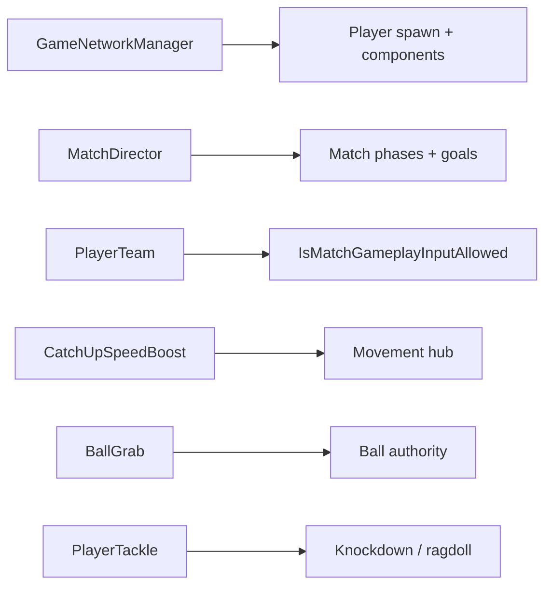

# Architecture — Ultimate Throwdown

**What this is:** A periodic check-up of how the codebase is organized, what’s working, and what to fix before the project outgrows its prototype shape.

**When to read this:**

| When | Why |
|------|-----|
| **Before slice 5/6** (per-class prefabs + Juggernaut + Sniper ults) | Prefab split and new class ults will amplify any structural debt — read **§ Before slice 5/6** first |
| Before adding **weapons** (slice 7) | Use Ball + planned `Code/Weapons/` layout as the model |
| Before splitting a file past ~500 lines | See **§ God components** and the folder patterns below |
| Every few months | Skim **§ Current health** and **§ Prioritized improvements** |

**Related docs:** [`SESSION_NOTES.md`](SESSION_NOTES.md) (day-to-day), [`NAMING_CANON.md`](NAMING_CANON.md) (names), [`MULTIPLAYER_NETCODE.md`](MULTIPLAYER_NETCODE.md) (host/predict), [`GAMEPLAY_DESIGN.md`](GAMEPLAY_DESIGN.md) (mechanics).

---

## Before slice 5/6 — read this first

**Prefab split + loadout v1 ✅ (2026-07-06).** Slice 5/6 is **Juggernaut stomp** + **Sniper path zones** on the existing per-class prefabs.

**Hybrid spawn policy (locked):**

- **Class prefabs** own the **full** gameplay stack — ball, tackle, dodge, ult, HUDs, cameras, feel relays, loadout — editor WYSIWYG. **No runtime auto-add** on spawned pawns (see `.cursor/rules/no-auto-add-components.mdc`).
- **`GameNetworkManager`** clones the class template, sets `PlayerTeam` / applies `PlayerLoadout`, validates expected components (`WarnMissingPlayerPrefabComponents`), then `NetworkSpawn`s.
- **Speedster prefab only:** `SpeedsterSpeedBlitzUlt`, `SpeedBlitzAimPreview`, blitz feel/cam/glow, `BlitzConnectPoseFreeze`, `PlayerSpeedBlitzWindUpAnim`.
- **Juggernaut / Sniper:** add stomp / path-zone ult + preview when built (slice 5/6).

**Still recommended before/during slice 5/6:**

1. ~~**Split `PlayerTackle`**~~ — **✅ A1–A3 shipped (2026-07-07)** → `TackleRagdollLifecycle`, `TackleImpactRelay`, `PracticeNpcTackleClientRelay` (~1,175 lines left on orchestrator). **A4** (ragdoll orbit camera) **deferred** — not needed for stomp/melee/zones.
2. ~~**Split `SpeedsterSpeedBlitzUlt`**~~ — **✅ B1–B2 shipped (2026-07-08)** → `SpeedBlitzDashHitDetector`, `SpeedBlitzConnectImpactRelay` (~1,189 lines left on orchestrator). **B3** (owner movement extract) **optional**.
3. **Per-class prefab checklist** — see **§ Loadout & spawn** + **§ Component wiring** below when duplicating components.

**Can wait:** Match HUD replication refactor; `Code/Weapons/` (slice 7); C# namespaces.

---

## Loadout & spawn

Three layers — **do not** put loadout on `PlayerTeam`:

| Layer | Role |
|-------|------|
| **`LoadoutPersistence`** | Local save by SteamId (`FileSystem.Data`) — `loadouts/{steamId}.json` |
| **`PlayerLoadout`** | On spawned pawn — host apply, swap RPCs, `[Sync(FromHost)]` equipped ids, explicit ult for `PlayerUltCharge` |
| **`PlayerTeam`** | Match flow only — phase, OOB mirror, round reset |

**Spawn flow (`GameNetworkManager`):**

1. Read `LoadoutPersistence.GetOrCreateCommitted(steamId)` (host disk; joiner's file if they've connected before).
2. `ResolvePlayerTemplateForClass(classId)` → clone `SpeedsterPlayerTemplate` / `JuggernautPlayerTemplate` / `SniperPlayerTemplate` (fallback `PlayerTemplateRoot`).
3. `PlayerLoadout.ApplyCommittedLoadoutOnHost` at spawn.
4. Validate prefab components; `NetworkSpawn(connection)`.
5. **Join sync:** owning client's `LoadoutClientState.OnStart` → `SubmitCommittedLoadoutFromOwnerRpc` → host re-applies (second apply on connect).

**Class change:** host destroys pawn → respawn with new class template. Ult/passive-only change → in-place apply + `ResyncFromEquippedUltOnHost()`.

**Validation:** `LoadoutAuthority.TryValidateCommittedLoadout` (catalog + `IsLoadoutAllowedForPlayer` stub — returns true until progression slice).

Design rules (pending/committed, when swaps allowed) → [`GAMEPLAY_DESIGN.md`](GAMEPLAY_DESIGN.md) § Loadout.

---

## Before slice 5/6 — historical note

<details>
<summary>Original pre-split checklist (2026-06 — prefab split now shipped)</summary>

Previously: standardize spawn wiring, split tackle/ult monoliths, per-class checklist before duplicating prefabs. Prefab split completed 2026-07-06; monolith splits still recommended.

</details>

---

## Current health (2026-07)

~60 gameplay `.cs` files under `Code/`, organized by system. s&box **component model**, **host-authoritative** multiplayer, strong docs triangle (`NAMING_CANON` + `MULTIPLAYER_NETCODE` + `SESSION_NOTES`).

### System folders

| Folder | Files (approx.) | Health |
|--------|-----------------|--------|
| `Code/Ball/` | 8 | **Model subsystem** — authority, throw, feel, math, UI split cleanly |
| `Code/Match/` | 5 | **Clean** — small phase FSM, goals, team IDs |
| `Code/Network/` | 1 | Spawn + loadout apply entry point |
| `Code/Ultimates/` | 5 | Partially extracted (VFX/glow/wind-up feel); core ult still monolithic |
| `Code/Player/` | 24+ | **Largest** — movement hub, combat, loadout client state |
| `Code/UI/` | 16 | Well split (match HUD panels, owner HUDs, comic burst) |
| `Code/Map/` | 5 | Traffic, lights, bootstrap — reasonable |

### Mental model



**Host referee + client feel** (consistent across ball, dodge, tackle, ult):

1. **Host** owns truth via `[Sync(SyncFlags.FromHost)]`
2. **Owner** sends `[Rpc.Host]` for actions
3. **Feel** runs early on the owner (`TackleImpactFeel`, dodge predict, blitz dash camera)
4. **`CombatFeelPredictDedupe`** prevents double-applying predicted feel

### Entry points

| Component | Role |
|-----------|------|
| `GameNetworkManager` | Join/spawn, team balance, round-reset teleports, partial auto-add of player components |
| `MatchDirector` | Host phase machine: Playing → GoalCelebration → Intermission → MatchOver |
| `PlayerTeam` | Team id, **mirrored match HUD state**, round-reset pose, `IsMatchGameplayInputAllowed` |
| `CatchUpSpeedBoost` | Movement integration hub — class speeds, gates tackle/dodge/ult |
| `BallGrab` / `BallThrow` | Ball pipeline, gated on match phase |

---

## What’s working well

### Ball is the gold standard

`BallGrab` (authority), `BallThrow` (charge/release), `BallClientFeel` (visual only), `ThrowReleaseMath` (shared math), `ThrowTrajectoryPreview` (owner UI). New features should copy this split.

### Documentation does architectural work

`NAMING_CANON.md` records auto-add vs manual prefab rules, input bindings, and component jobs — not just a glossary. `MULTIPLAYER_NETCODE.md` tiers (0–A shipped) match the code.

### Match HUD is sensibly split

Small draw components (`MatchScoreHud`, `MatchClockHud`, …) sharing `MatchHudDraw` helpers.

### Ultimates folder is headed the right way

Already split:

- `SpeedsterSpeedBlitzUlt` — orchestrator (phases, host knockdown, owner movement)
- `SpeedBlitzDashHitDetector` + `SpeedBlitzConnectImpactRelay` — Track B siblings
- `SpeedBlitzWindUpFeel` — VFX/SFX during wind-up
- `SpeedBlitzBodyGlow` + render system — dasher tint
- `SpeedBlitzVfxResources` — shared asset loading

That’s the target pattern for Juggernaut/Sniper ults — **pre-split from line 1** on new mechanics (Track B B1–B2 ✅; optional B3 deferred).

### Phase gating is centralized

Almost everything checks `PlayerTeam.IsMatchGameplayInputAllowed` — one gate, one rule.

---

## Where it’s straining

### God components

| File | ~Lines | Bundled concerns |
|------|--------|------------------|
| `PlayerTackle.cs` | **~1,175** | Detection, RPC validation, host knockdown authority, owner camera blend, Juggernaut ramp — siblings: `TackleRagdollLifecycle`, `TackleImpactRelay`, `PracticeNpcTackleClientRelay` |
| `SpeedsterSpeedBlitzUlt.cs` | **~1,189** | Phases, host knockdown, owner movement/predict, charge block, wind-up resolve — siblings: `SpeedBlitzDashHitDetector`, `SpeedBlitzConnectImpactRelay` (+ existing feel/cam/glow) |
| `CatchUpSpeedBoost.cs` | 544 | Movement tiers + every combat input gate |
| `TrafficCar.cs` | 603 | Path, knockdown, audio, proxy interpolation |

`PlayerTackle` includes an inline “quick map” at the top — intentional navigation. **Track A (A1–A3) shipped 2026-07-07**; **Track B (B1–B2) shipped 2026-07-08** — optional A4/B3 deferred.

### Match state replication workaround

`MatchDirector` lives on a scene object (e.g. Main Camera) and **does not replicate** to remote clients the way player components do. So ~9 HUD fields are **mirrored onto every `PlayerTeam`**, with duplicate push logic in `MatchDirector` and `GameNetworkManager`.

Works today; hurts when map vote, spectators, or more HUD fields arrive. Future options: networked match-state object on a scene root, or a tiny dedicated replicator component.

### Inconsistent component spawn policy — resolved (2026-07-07)

Previously `GameNetworkManager` auto-added feel/anim/HUD pieces at spawn. **Policy now:** everything lives on prefabs/scene objects; code uses `ComponentRequire` and logs when missing. Runtime auto-add is limited to ragdoll outline, engine `HighlightOutline` helpers, `Highlight` via `EnemyOutlineCameraSetup`, and programmatic child GOs — see `no-auto-add-components.mdc`.

### Component wiring (editor checklist)

**Every player class prefab:** `PlayerTeam`, `PlayerLoadout`, `PlayerDisableCrouch`, `PlayerEnemyOutline`, `BallCompassHud`, `PlayerBallHoldAnim`, `PlayerChargeRunAnim`, `TackleImpactFeel`, `CombatFeelPredictDedupe`, `PlayerFootstepAudio`, `PracticeNpcPatrolPoseRelay`, `LoadoutClientState`, `LoadoutPickerHud`, `TackleRagdollLifecycle`, `TackleImpactRelay`, `PracticeNpcTackleClientRelay`, plus core gameplay (`BallGrab`, `BallThrow`, `CatchUpSpeedBoost`, `PlayerDodge`, `PlayerTackle`, `PlayerUltCharge`, `PlayerClass`, throw/charge HUDs, `RagdollClientFeel`, …).

**Juggernaut prefab additionally:** `JuggernautQuakeSlamUlt`, `QuakeSlamOwnerPredict`, `QuakeSlamAimPreview`, `QuakeSlamFeel`.

**Speedster prefab additionally:** `SpeedsterSpeedBlitzUlt`, `SpeedBlitzDashHitDetector`, `SpeedBlitzConnectImpactRelay`, `SpeedBlitzAimPreview`, `SpeedBlitzDashCamera`, `SpeedBlitzWindUpFeel`, `SpeedBlitzBodyGlow`, `PlayerSpeedBlitzWindUpAnim`, `BlitzConnectPoseFreeze`.

**Main Camera (per gameplay scene):** `EnemyOutlineCameraSetup`, `TackleComicTextHud`, `MatchAudioBootstrap`, `OutOfBoundsBannerHud`, `BallOobDropZoneHud`.

**Ball (`main_ball`):** `BallCarrierOutline`, `BallLastTouchLedger`, `BallPassAssistState`, `BallOutOfBoundsHost`.

**Practice static dummies (`practice_npc`):** at minimum `PlayerTackle`, `TackleRagdollLifecycle`, `TackleImpactRelay`, `PracticeNpcTackleClientRelay`, `CombatFeelPredictDedupe`; add `TackleImpactFeel` if victim knockdown feel should fire on the dummy.

**Practice patrol runner:** above + `PracticeNpcPatrol`, `PracticeNpcPatrolPoseRelay`.

**Practice arena launch lane (`practice_arena` scene):** on **`LaunchReadoutSign`** — `PracticeLaunchReadout`, `WorldPanel`, and **`PracticeLaunchReadoutRoot`** (all three on the same GameObject; root builds the score panel). On **`PracticeLaunchLane`** — `PracticeLaunchMeasure` with **Readout Sign** dragged to `LaunchReadoutSign`.

### Scene-wide lookups

Several systems scan for `main_ball`, `MatchDirector`, player template, etc. Fine for one map; fragile with map vote, practice scene, or multiple loaded roots. Prefer inspector wiring on a map root (pattern already used for `MatchDirector.BallSpawn`).

### CatchUpSpeedBoost as integration hub

Movement directly references ball, dodge, tackle, and ult. Acceptable at three classes if it stays a **thin coordinator**. If combat rules keep growing, extract a small helper that answers “what input is blocked this frame?” so movement doesn’t accumulate every new mechanic.

---

## New mechanic pre-split pattern

**Why:** God components here are not caused by messy code — they're caused by every mechanic being **three programs in one file**: host authority, owner predict, and feel/presentation. Each network role grows independently, so one file grows ~3× per feature (`PlayerTackle`, `SpeedsterSpeedBlitzUlt`). The fix is deciding the split **before writing the mechanic**, not refactoring at 500+ lines.

### The three roles (siblings on the same GameObject)

| Sibling | Owns | Typical contents |
|---------|------|------------------|
| **`<Mechanic>` (authority orchestrator)** | Truth + tunables | `[Property]` tuning, `[Sync(FromHost)]` state, host phase machine, `[Rpc.Host]` validation, hit/effect application. **All inspector tunables live here** so feel/predict siblings read them and no editor re-wiring is needed later. |
| **`<Mechanic>OwnerPredict`** (or `...Movement`) | Owner-side responsiveness | Input handling, local predict of hits/movement, controller suppression, dedupe marks via `CombatFeelPredictDedupe`. |
| **`<Mechanic>Feel`** | Presentation only | SFX resolve + playback, VFX prefab spawn/fallback, camera blends, anim overlays. Reads the orchestrator's synced surface; **never writes gameplay state**. |

Plus shared **pure math** in a static class when host and predict need identical geometry (`ThrowReleaseMath` is the model — both `BallThrow` and `ThrowTrajectoryPreview` call it, zero drift between host hit test and owner predict).

### When a single file is fine

Skip the split only when the mechanic has **no owner predict** and **no feel plumbing** (e.g. a passive host-side modifier). If it has input + a hit test + a sound, it's three roles — split from line 1.

### Checklist when starting a new mechanic (ult, weapon, combat move)

1. Name the siblings up front (follow `NAMING_CANON.md`; e.g. `JuggernautGroundStompUlt` + `StompOwnerPredict` + `StompImpactFeel`) and place them per the folder layout below (`Code/Ultimates/Juggernaut/`, etc.).
2. All `[Property]` tunables go on the orchestrator — siblings read them via `Components.Get<>()`. This keeps editor wiring on one component.
3. RPCs work on any sibling (same networked GameObject) — proven by `TackleImpactRelay`, `TackleImpactFeel`.
4. Shared hit geometry → static pure-math class, called by both host check and owner predict.
5. Max adds the siblings to the prefab manually (`no-auto-add-components.mdc`); use `ComponentRequire.WarnIfMissing<>` from the orchestrator.
6. Follow the `MULTIPLAYER_NETCODE.md` new-combat-feature checklist for the predict/dedupe tier.

**Reference implementations:** `Code/Ball/` (authority/throw/feel/math split), tackle siblings post-Track A, Speed Blitz post-Track B (hit detector + connect SFX relay).

---

## Folder patterns — primary file + siblings (not partial classes)

**Use:** one **folder per system** + **focused sibling components** on the same GameObject.

**Avoid:**

- One mega-file (`Ultimates.cs` owning everything)
- C# `partial class` splits of a single component across files (same GameObject, harder to mix per-class prefabs)
- Putting weapons under `Code/Player/` when slice 7 lands

### Recommended layout going forward

```
Code/Ultimates/
  PlayerUltCharge.cs              ← shared meter (exists)
  Speedster/
    SpeedsterSpeedBlitzUlt.cs     ← thin orchestrator (target ~200–300 lines)
    SpeedBlitzWindUpFeel.cs       ← exists (move under Speedster/ when splitting)
    SpeedBlitzBodyGlow.cs         ← exists
    SpeedBlitzVfxResources.cs     ← exists
  Juggernaut/
    JuggernautQuakeSlamUlt.cs   ← slice 5 ✅
    QuakeSlamOwnerPredict.cs
    QuakeSlamAimPreview.cs
    QuakeSlamFeel.cs
    QuakeSlamRadiusMath.cs
  Sniper/
    SniperBallPathUlt.cs          ← slice 6
```

Add `IUltAbility` or a shared base **only when 3+ ults share the same equip → commit → cooldown lifecycle**. One ult does not need an interface yet.

```
Code/Weapons/                     ← slice 7
  (mirror Ball/: authority vs feel vs UI per weapon)
```

---

## Prioritized improvements

### Before slice 5/6

| # | Task | Why | Status |
|---|------|-----|--------|
| 1 | Split `PlayerTackle` | Juggernaut/Sniper touch tackle rules | **✅ A1–A3 (2026-07-07)** — A4 deferred |
| 2 | Standardize spawn wiring | Three prefabs = triple the “forgot a component” risk | **✅ (2026-07-07)** — `ComponentRequire`, no auto-add |
| 3 | Split `SpeedsterSpeedBlitzUlt` | Template for Juggernaut + Sniper ults | **✅ B1–B2 (2026-07-08)** — B3 optional |
| 4 | Per-class prefab checklist | Document once; duplicate safely | **✅** — § Component wiring |

### When match UI grows (map vote, spectators)

| # | Task | Why |
|---|------|-----|
| 5 | Fix match HUD mirroring | Stop duplicating fields on every `PlayerTeam` |
| 6 | Wire map root refs | Less `FindInScene` / name scanning |

### When adding weapons (slice 7)

| # | Task | Why |
|---|------|-----|
| 7 | Add `Code/Weapons/` | Keep Player from growing |
| 8 | Shared camera guard helper | `ThrowChargeCamera`, `SpeedBlitzDashCamera`, tackle feel repeat the same “should I control FOV/offset?” checks |

### Low priority / hygiene

| # | Task | Why |
|---|------|-----|
| 9 | C# namespaces | See **§ Namespaces** — optional until file count or name collisions grow |
| 10 | Prune shipped items from `SESSION_NOTES` Open decisions | Doc noise only |

---

## Namespaces

**What they are:** In C#, a `namespace` is a prefix that groups related types so names don’t collide. Example:

```csharp
namespace UltimateThrowdown.Ball
{
    public sealed class BallGrab : Component { ... }
}
```

Elsewhere you refer to it as `UltimateThrowdown.Ball.BallGrab`, or add `using UltimateThrowdown.Ball;` at the top of a file.

**What you have today:** Every gameplay script is in the **global namespace** — no `namespace` block. Types are just `BallGrab`, `PlayerTackle`, `MatchDirector`, etc. At ~60 files with unique, descriptive names, that’s **fine**. s&box finds components by type name on the GameObject; namespaces don’t change how components attach in the editor.

**When namespaces help:**

- **Name collisions** — e.g. you add a `Weapon` class and a UI panel also called `Weapon`, or you import a library with conflicting names.
- **Large codebases** — 100+ files, multiple systems, or shared code pulled into another project.
- **Clarity in IDEs** — Solution explorer can group by namespace instead of one flat list (minor benefit if folders already mirror systems).

**When they’re not worth it yet:**

- Your folders (`Code/Ball/`, `Code/Player/`, …) already provide the same mental grouping.
- Adding namespaces touches **every file** and every `using` — churn without gameplay benefit at current size.
- s&box hotload and scene serialization care about **type names**, not folder paths; a namespace rename is a breaking change for anything that referenced the old full name.

**Practical rule for this project:** Stay global until either (a) you exceed ~100 gameplay files, (b) you hit a real naming collision, or (c) you extract a reusable library. If you adopt them later, a single root like `UltimateThrowdown` with sub-namespaces matching folders (`UltimateThrowdown.Ball`, `.Player`, `.Match`) is enough — don’t over-nest.

---

## Bottom line

**Strengths:** Clear system folders, host-authoritative netcode with documented predict tiers, Ball/Match as reference implementations, naming canon aligned with code.

**Main gaps:** Match HUD field mirroring on `PlayerTeam`. Optional backfill: tackle **A4**, Speed Blitz **B3**.

**Before slice 5/6:** Tackle + Speed Blitz splits sufficient — proceed with Juggernaut stomp + Sniper zones using pre-split pattern. Full plan → [`REFACTOR_PLAN_TACKLE_ULT_SPLIT.md`](REFACTOR_PLAN_TACKLE_ULT_SPLIT.md).

---

*Last architecture review: 2026-07-08 (PlayerTackle Track A + Speed Blitz Track B recommended stopping points shipped). Update when completing a structural refactor or before the next major slice.*
