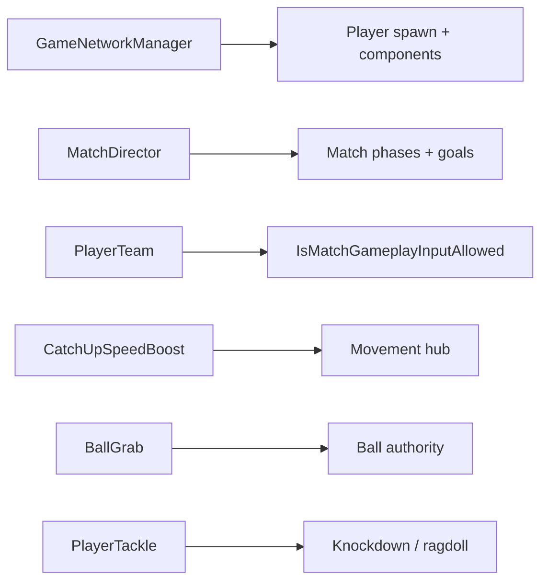

# Architecture — Ultimate Throwdown

**What this is:** A periodic check-up of how the codebase is organized, what’s working, and what to fix before the project outgrows its prototype shape.

**When to read this:**

| When | Why |
|------|-----|
| **Before slice 5/6** (per-class prefabs + Juggernaut + Sniper ults) | Prefab split and new class ults will amplify any structural debt — read **§ Before slice 5/6** first |
| Before adding **weapons** (slice 7) | Use Ball + planned `Code/Weapons/` layout as the model |
| Before splitting a file past ~500 lines | See **§ God components** and the folder patterns below |
| Every few months | Skim **§ Current health** and **§ Prioritized improvements** |

**Related docs:** [`SESSION_NOTES.md`](SESSION_NOTES.md) (day-to-day), [`NAMING_CANON.md`](NAMING_CANON.md) (names), [`MULTIPLAYER_NETCODE.md`](MULTIPLAYER_NETCODE.md) (host/predict), [`GAMEPLAY_DESIGN.md`](GAMEPLAY_DESIGN.md) (mechanics).

---

## Before slice 5/6 — read this first

Slice 5/6 is **per-class prefab variants** (`Player_Speedster` / `Player_Juggernaut` / `Player_Sniper`) plus **Juggernaut** and **Sniper** first ults. That work touches spawn wiring, component duplication, and combat size — exactly where the architecture is weakest today.

**Do these before or alongside the prefab split:**

1. **Standardize spawn wiring** — Pick one policy and stick to it:
   - **Option A:** `GameNetworkManager` auto-adds all gameplay components; prefab = visuals + `PlayerController` only.
   - **Option B:** Prefab owns everything; `GameNetworkManager` only adds `PlayerTeam` (+ documented exceptions).
   - Today you **mix both** — manual prefab for core gameplay, auto-add for feel/anim/HUD. Easy to forget a component on a new class prefab.

2. **Split `PlayerTackle`** — ~1,150 lines; Juggernaut/Sniper will add tackle-adjacent rules. Split along seams already noted in its file header (host detection, ragdoll lifecycle, hazard path, camera/stand-up).

3. **Split `SpeedsterSpeedBlitzUlt`** — ~1,089 lines; Juggernaut stomp and Sniper ball-zones will copy this pattern. Keep a thin orchestrator; host hit logic and feel stay in sibling files (wind-up feel is already extracted).

4. **Per-class prefab checklist** — When duplicating prefabs, use one checklist (from `NAMING_CANON.md` + this doc):
   - Shared: `BallGrab`, `BallThrow`, `CatchUpSpeedBoost`, `PlayerDodge`, `PlayerTackle`, `PlayerUltCharge`, `PlayerClass`, `PlayerTeam`, movement HUDs, etc.
   - Speedster-only: `SpeedsterSpeedBlitzUlt`, `SpeedBlitzAimPreview`, `BlitzConnectPoseFreeze` — **remove `BlitzConnectPoseFreeze` from global auto-add** in `GameNetworkManager`; keep on Speedster prefab only.
   - Juggernaut-only: (new stomp ult + preview when built)
   - Sniper-only: (new ball-path ult when built)

5. **Wire map root references** — Prefer inspector refs on a map root (`BallSpawn`, `main_ball`, `MatchDirector`, `GameNetworkManager`) over scene scans when setting up new scenes for class testing.

**Can wait until after slice 5/6 if needed:**

- Match HUD replication refactor (`MatchDirector` → `PlayerTeam` mirror)
- `Code/Weapons/` folder (slice 7)
- C# namespaces (see **§ Namespaces** — not urgent at current scale)

---

## Current health (2026-06)

~60 gameplay `.cs` files under `Code/`, organized by system. s&box **component model**, **host-authoritative** multiplayer, strong docs triangle (`NAMING_CANON` + `MULTIPLAYER_NETCODE` + `SESSION_NOTES`).

### System folders

| Folder | Files (approx.) | Health |
|--------|-----------------|--------|
| `Code/Ball/` | 8 | **Model subsystem** — authority, throw, feel, math, UI split cleanly |
| `Code/Match/` | 5 | **Clean** — small phase FSM, goals, team IDs |
| `Code/Network/` | 1 | Single spawn entry point |
| `Code/Ultimates/` | 5 | Partially extracted (VFX/glow/wind-up feel); core ult still monolithic |
| `Code/Player/` | 24 | **Largest + most coupled** — movement hub, combat, camera, anim overlays |
| `Code/UI/` | 16 | Well split (match HUD panels, owner HUDs, comic burst) |
| `Code/Map/` | 5 | Traffic, lights, bootstrap — reasonable |

### Mental model



**Host referee + client feel** (consistent across ball, dodge, tackle, ult):

1. **Host** owns truth via `[Sync(SyncFlags.FromHost)]`
2. **Owner** sends `[Rpc.Host]` for actions
3. **Feel** runs early on the owner (`TackleImpactFeel`, dodge predict, blitz dash camera)
4. **`CombatFeelPredictDedupe`** prevents double-applying predicted feel

### Entry points

| Component | Role |
|-----------|------|
| `GameNetworkManager` | Join/spawn, team balance, round-reset teleports, partial auto-add of player components |
| `MatchDirector` | Host phase machine: Playing → GoalCelebration → Intermission → MatchOver |
| `PlayerTeam` | Team id, **mirrored match HUD state**, round-reset pose, `IsMatchGameplayInputAllowed` |
| `CatchUpSpeedBoost` | Movement integration hub — class speeds, gates tackle/dodge/ult |
| `BallGrab` / `BallThrow` | Ball pipeline, gated on match phase |

---

## What’s working well

### Ball is the gold standard

`BallGrab` (authority), `BallThrow` (charge/release), `BallClientFeel` (visual only), `ThrowReleaseMath` (shared math), `ThrowTrajectoryPreview` (owner UI). New features should copy this split.

### Documentation does architectural work

`NAMING_CANON.md` records auto-add vs manual prefab rules, input bindings, and component jobs — not just a glossary. `MULTIPLAYER_NETCODE.md` tiers (0–A shipped) match the code.

### Match HUD is sensibly split

Small draw components (`MatchScoreHud`, `MatchClockHud`, …) sharing `MatchHudDraw` helpers.

### Ultimates folder is headed the right way

Already split:

- `SpeedsterSpeedBlitzUlt` — state machine + gameplay
- `SpeedBlitzWindUpFeel` — VFX/SFX during wind-up
- `SpeedBlitzBodyGlow` + render system — dasher tint
- `SpeedBlitzVfxResources` — shared asset loading

That’s the target pattern for Juggernaut/Sniper ults — finish splitting the core ult file before copying the template.

### Phase gating is centralized

Almost everything checks `PlayerTeam.IsMatchGameplayInputAllowed` — one gate, one rule.

---

## Where it’s straining

### God components

| File | ~Lines | Bundled concerns |
|------|--------|------------------|
| `PlayerTackle.cs` | 1,150 | Detection, RPC validation, ragdoll lifecycle, hazard path, camera, stand-up, comic notify, ult charge, Juggernaut ramp |
| `SpeedsterSpeedBlitzUlt.cs` | 1,089 | Input, phases, movement, host hit test, knockdown, charge block, VFX hooks |
| `CatchUpSpeedBoost.cs` | 544 | Movement tiers + every combat input gate |
| `TrafficCar.cs` | 603 | Path, knockdown, audio, proxy interpolation |

`PlayerTackle` includes an inline “quick map” at the top — intentional navigation for a file that grew past comfortable size.

### Match state replication workaround

`MatchDirector` lives on a scene object (e.g. Main Camera) and **does not replicate** to remote clients the way player components do. So ~9 HUD fields are **mirrored onto every `PlayerTeam`**, with duplicate push logic in `MatchDirector` and `GameNetworkManager`.

Works today; hurts when map vote, spectators, or more HUD fields arrive. Future options: networked match-state object on a scene root, or a tiny dedicated replicator component.

### Inconsistent component spawn policy

`GameNetworkManager` auto-adds feel/anim/HUD pieces (`PlayerBallHoldAnim`, `TackleImpactFeel`, `CombatFeelPredictDedupe`, …).

Core gameplay must be on the **prefab manually** (`BallGrab`, `BallThrow`, `CatchUpSpeedBoost`, `PlayerTackle`, `PlayerUltCharge`, `SpeedsterSpeedBlitzUlt`).

Documented in `NAMING_CANON.md`, but a footgun when duplicating three class prefabs.

### Scene-wide lookups

Several systems scan for `main_ball`, `MatchDirector`, player template, etc. Fine for one map; fragile with map vote, practice scene, or multiple loaded roots. Prefer inspector wiring on a map root (pattern already used for `MatchDirector.BallSpawn`).

### CatchUpSpeedBoost as integration hub

Movement directly references ball, dodge, tackle, and ult. Acceptable at three classes if it stays a **thin coordinator**. If combat rules keep growing, extract a small helper that answers “what input is blocked this frame?” so movement doesn’t accumulate every new mechanic.

---

## Folder patterns — primary file + siblings (not partial classes)

**Use:** one **folder per system** + **focused sibling components** on the same GameObject.

**Avoid:**

- One mega-file (`Ultimates.cs` owning everything)
- C# `partial class` splits of a single component across files (same GameObject, harder to mix per-class prefabs)
- Putting weapons under `Code/Player/` when slice 7 lands

### Recommended layout going forward

```
Code/Ultimates/
  PlayerUltCharge.cs              ← shared meter (exists)
  Speedster/
    SpeedsterSpeedBlitzUlt.cs     ← thin orchestrator (target ~200–300 lines)
    SpeedBlitzWindUpFeel.cs       ← exists (move under Speedster/ when splitting)
    SpeedBlitzBodyGlow.cs         ← exists
    SpeedBlitzVfxResources.cs     ← exists
  Juggernaut/
    JuggernautGroundStompUlt.cs   ← slice 5
  Sniper/
    SniperBallPathUlt.cs          ← slice 6
```

Add `IUltAbility` or a shared base **only when 3+ ults share the same equip → commit → cooldown lifecycle**. One ult does not need an interface yet.

```
Code/Weapons/                     ← slice 7
  (mirror Ball/: authority vs feel vs UI per weapon)
```

---

## Prioritized improvements

### Before slice 5/6

| # | Task | Why |
|---|------|-----|
| 1 | Split `PlayerTackle` | Juggernaut/Sniper touch tackle rules |
| 2 | Standardize spawn wiring | Three prefabs = triple the “forgot a component” risk |
| 3 | Split `SpeedsterSpeedBlitzUlt` | Template for Juggernaut + Sniper ults |
| 4 | Per-class prefab checklist | Document once; duplicate safely |

### When match UI grows (map vote, spectators)

| # | Task | Why |
|---|------|-----|
| 5 | Fix match HUD mirroring | Stop duplicating fields on every `PlayerTeam` |
| 6 | Wire map root refs | Less `FindInScene` / name scanning |

### When adding weapons (slice 7)

| # | Task | Why |
|---|------|-----|
| 7 | Add `Code/Weapons/` | Keep Player from growing |
| 8 | Shared camera guard helper | `ThrowChargeCamera`, `SpeedBlitzDashCamera`, tackle feel repeat the same “should I control FOV/offset?” checks |

### Low priority / hygiene

| # | Task | Why |
|---|------|-----|
| 9 | C# namespaces | See **§ Namespaces** — optional until file count or name collisions grow |
| 10 | Prune shipped items from `SESSION_NOTES` Open decisions | Doc noise only |

---

## Namespaces

**What they are:** In C#, a `namespace` is a prefix that groups related types so names don’t collide. Example:

```csharp
namespace UltimateThrowdown.Ball
{
    public sealed class BallGrab : Component { ... }
}
```

Elsewhere you refer to it as `UltimateThrowdown.Ball.BallGrab`, or add `using UltimateThrowdown.Ball;` at the top of a file.

**What you have today:** Every gameplay script is in the **global namespace** — no `namespace` block. Types are just `BallGrab`, `PlayerTackle`, `MatchDirector`, etc. At ~60 files with unique, descriptive names, that’s **fine**. s&box finds components by type name on the GameObject; namespaces don’t change how components attach in the editor.

**When namespaces help:**

- **Name collisions** — e.g. you add a `Weapon` class and a UI panel also called `Weapon`, or you import a library with conflicting names.
- **Large codebases** — 100+ files, multiple systems, or shared code pulled into another project.
- **Clarity in IDEs** — Solution explorer can group by namespace instead of one flat list (minor benefit if folders already mirror systems).

**When they’re not worth it yet:**

- Your folders (`Code/Ball/`, `Code/Player/`, …) already provide the same mental grouping.
- Adding namespaces touches **every file** and every `using` — churn without gameplay benefit at current size.
- s&box hotload and scene serialization care about **type names**, not folder paths; a namespace rename is a breaking change for anything that referenced the old full name.

**Practical rule for this project:** Stay global until either (a) you exceed ~100 gameplay files, (b) you hit a real naming collision, or (c) you extract a reusable library. If you adopt them later, a single root like `UltimateThrowdown` with sub-namespaces matching folders (`UltimateThrowdown.Ball`, `.Player`, `.Match`) is enough — don’t over-nest.

---

## Bottom line

**Strengths:** Clear system folders, host-authoritative netcode with documented predict tiers, Ball/Match as reference implementations, naming canon aligned with code.

**Main gaps:** Two combat monoliths (`PlayerTackle`, `SpeedsterSpeedBlitzUlt`), match HUD field mirroring on `PlayerTeam`, mixed spawn policy — not missing top-level folders.

**Before slice 5/6:** Read **§ Before slice 5/6** at the top of this file, then split tackle/ult and lock spawn wiring before duplicating three class prefabs.

---

*Last architecture review: 2026-06-18. Update this file when you complete a structural refactor or before the next major slice milestone.*
